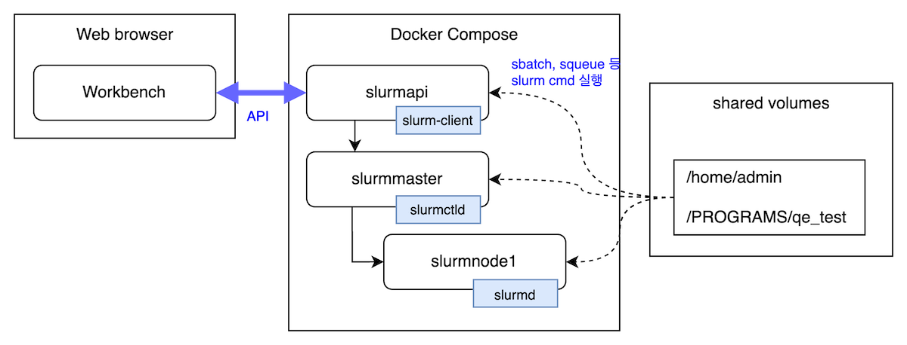

# 구성



slurmapi 컨테이너에 API를 서비스를 구축하여 제공
sbatch, squeue 등의 명령어 실행 가능

# 폴더 설명

- /home/admin : 사용자 홈 디렉터리
- /PROGRAMS : 프로그램 보관 폴더
  - /qe_test : 프로그램 명 qe_test
    - script_modeling.py : main 실행 파이썬 프로그램
    - inputs : 샘플 입력 파일
    - datas : 프로그램 실행시 필요한 파일들(소재 구조 파일)
    - batchscript : slurm batch 스크립트 파일

# docker-compose 실행

```
docker-compose up -d
```

# 작업 생성 예시 방법

slrumapi 서버 접속

```
docker exec -it slurm-cluster-slurmapi-1 /bin/bash
```

```
mkdir -p job/1
cd job/1

cp /PROGRAMS/qe_demo/batchscript/batch.sh .
sbatch batch.sh
```

# docker-compose 중단 및 삭제

```
docker-compose down
```
